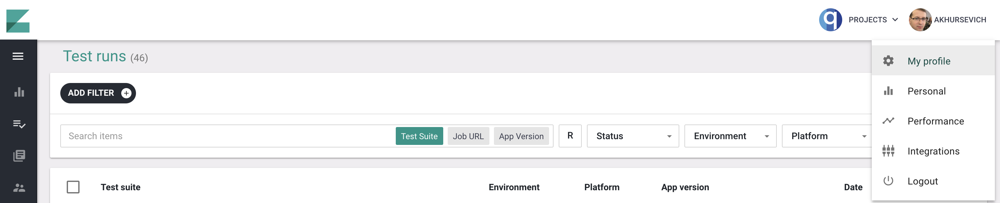
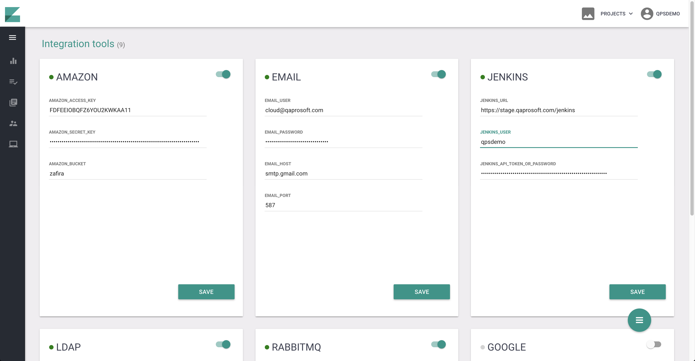
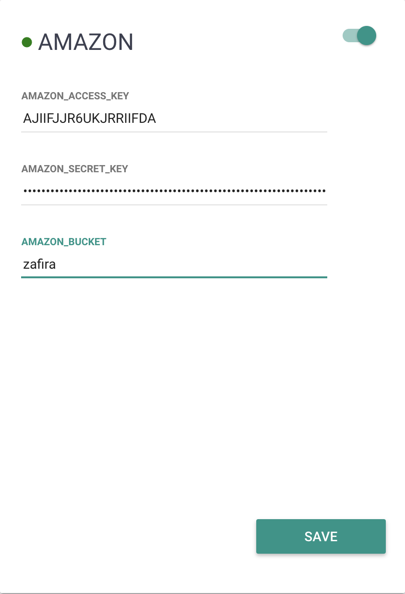
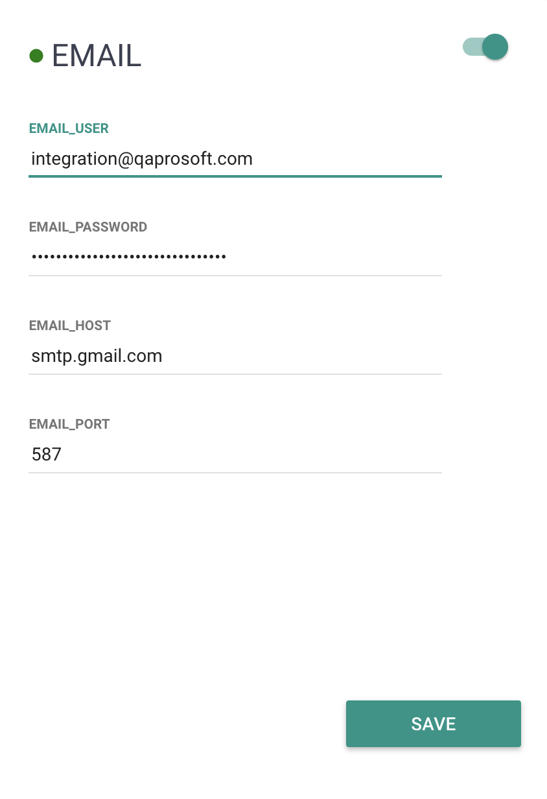
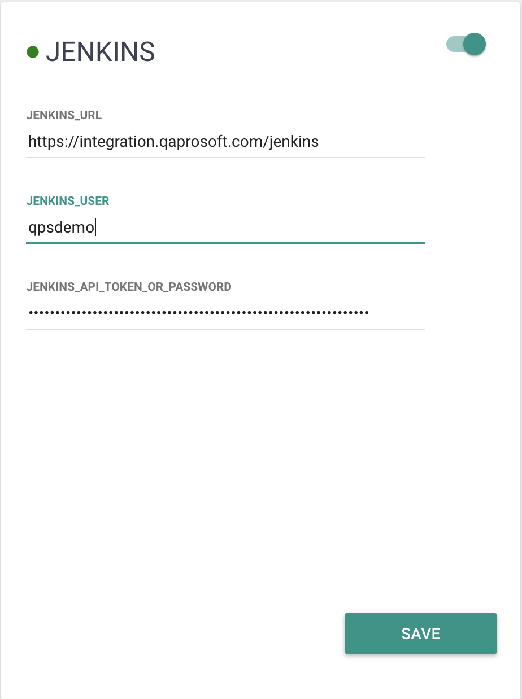
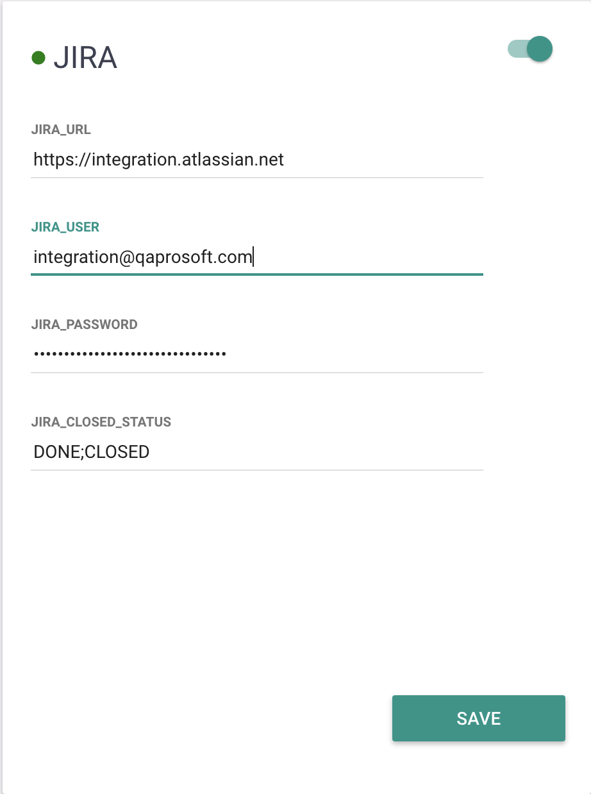
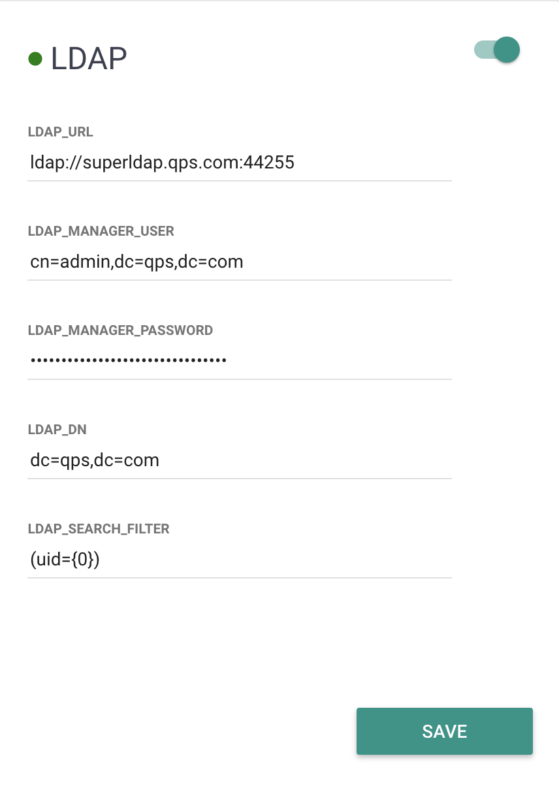
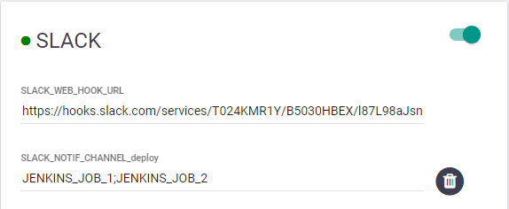

# Integration

Zafira is integrated with multiple third-party tools like Amazon, Slack, Gmail, etc. You are able to add new integrations in working Zafira without having to restart the whole web application. Navigate to **Username > Integrations** in the top navigation menu:

<p align="center">
  
</p>

On the "Integrations" page you will find multiple blocks responsible for different integration modules. Pay attention to the fact that security model HTTP/HTTPS may affect your integration URL.

<p align="center">
  
</p>


#### Amazon
Zafira uses integration with Amazon S3 service to store user profile photos and a company logo. First of all, we will need to create a new S3 bucket and generate access token to provide API access to Amazon S3 from Zafira.

* Create a new S3 bucket in a region you prefer
* Navigate to bucket permissions, CORS configuration and set the following policy:
```
<?xml version="1.0" encoding="UTF-8"?>
<CORSConfiguration xmlns="http://s3.amazonaws.com/doc/2006-03-01/">
<CORSRule>
    <AllowedOrigin>*</AllowedOrigin>
    <AllowedMethod>GET</AllowedMethod>
    <AllowedMethod>POST</AllowedMethod>
    <MaxAgeSeconds>3000</MaxAgeSeconds>
    <AllowedHeader>*</AllowedHeader>
</CORSRule>
</CORSConfiguration>
```
* Create a new IAM user with **Programmatic access**
* Grant read/write permissions for the new user (read [detailed guide](https://aws.amazon.com/blogs/security/writing-iam-policies-how-to-grant-access-to-an-amazon-s3-bucket/))
* Generate new access/secret keys
* Turn on Amazon integration and provide access/secret keys and the name of the bucket you've created
* Press save and refresh the page, a green light indicates correct integration status

<p>
  
</p>


#### Email
Zafira provides functionality for sending test results, widgets and dashboards via email. You have to specify correct SMTP credentials to enable this feature. We are mostly using Gmail for these purposes. You can use the configuration below by replacing email and password with your valid Gmail credentials.

* Turn on Email integration
* Specify correct SMTP host and port
* Specify valid Gmail credentials 
* Press save and refresh the page, a green light indicates correct integration status

<p>
  
</p>

#### Jenkins
Jenkins integration is used for triggering new builds and collecting test jobs configuration during the startup. Also, Zafira provides remote debug with Jenkins integration enabled. For Jenkins integration follow the next steps:

* Create user with READ,RUN access for jobs
* Generate access token (read [instruction](https://support.cloudbees.com/hc/en-us/articles/115003090592-How-to-re-generate-my-Jenkins-user-token))
* Paste Jenkins URL, username and token to Zafira
* Press save and refresh the page, a green light indicates correct integration status

<p>
  
</p>

#### Jira
Jira integration allows to track known issues status for the failed test cases. When you assign a known issue to the contstantly failing test cases you may specify an appropriate Jira ticket. If Jira integration is enabled, Zafira will check current ticket status and track failure as a known issue if the ticket is opened and as an unknown issue if the ticket is closed, so you will never lose regression bugs.

* Paste Jira URL, username and password to Zafira
* List a set of statuses which indicate that a ticket is closed
* Press save and refresh the page, a green light indicates correct integration status

<p>
  
</p>

#### LDAP
Zafira supports LDAP authentication, in this case on the first successful login via LDAP Zafira will register user details in its own database. Admin will be able to manage user permissions for every new user who logged in via LDAP. 

* Use configuration below as a reference for your LDAP connection setup
* Press save and refresh the page, a green light indicates correct integration status

<p>
  
</p>


#### SLACK
Zafira is capable of posting test automation results into specific Slack channels for a better visibility.
If integration is set up correctly, a notification with run details will be sent to the corresponding channel after a testrun is finished. Such Slack notification contains main information on a testrun and also includes links to this run in Zafira and Jenkins.
After a user marks some runs as reviewed and Slack integration is configured for an executed Jenkins job, the user will be proposed to send a notification about the reviewed run to Slack.
In order to setup Slack integration follow the next steps:

* Generate Slack web hook url and add it as parameter SLACK_WEB_HOOK_URL into SLACK block at Zafira integrations page
* For each Jenkins job you need integration for add parameters in Zafira using next pattern: **SLACK_NOTIF_CHANNEL_real_channel_name=JENKINS_JOB_1;JENKINS_JOB_2** where
  * real_channel_name - name of the Slack channel to send notifications to
  * JENKINS_JOB_1 and JENKINS_JOB_2 - names of Jenkins jobs
* You may add as many integrations as you need. For each new Slack channel create a new parameter in SLACK section in Zafira
* Press save and refresh the page, a green light indicates correct integration status

<p>
  
</p>
